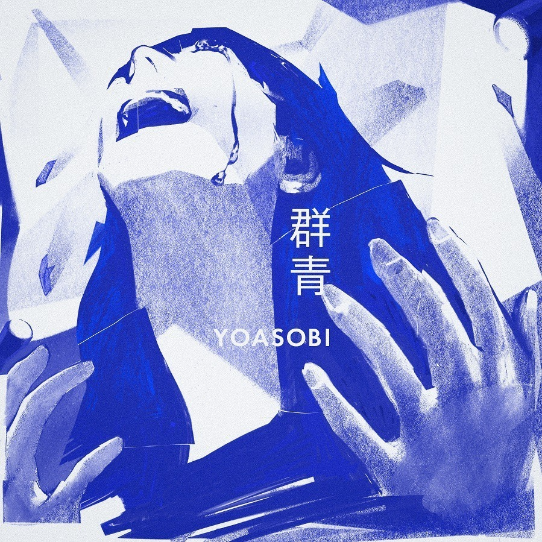
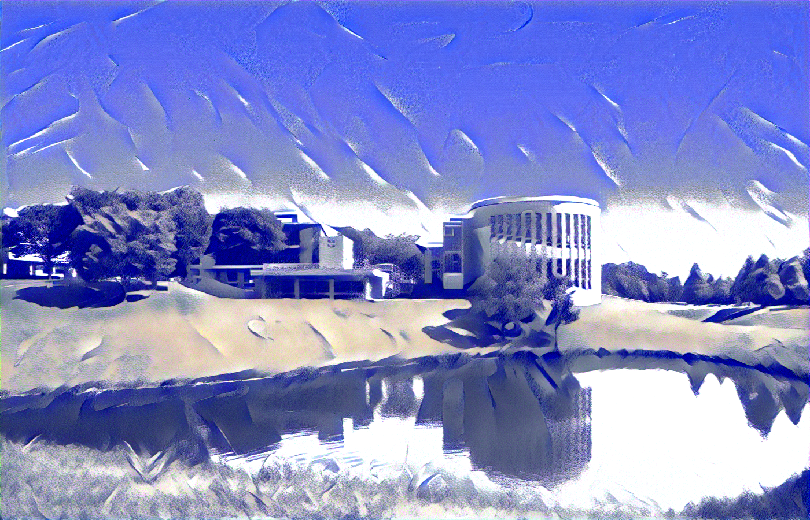

# Neural Style Transfer

[ [English](nst.md) ]

## 概要

Neural Style Transfer (NST)は、その名の通り、ある画像のスタイルを別の画像に転写/適用する技術です。

**用語**

- content image: スタイルを適用したい対象の画像
- style image: 適用したいスタイルを含んだ画像
- generated image: 生成結果 (スタイルが適用された content image)

1. 訓練ずみの CNN モデル(VGG16 など)を用意する
2. "generated image"をランダムに生成する(もしくは content image をそのままコピペする)
3. 各エポックごとに以下の作業を繰り返す
   3.1 content image, style image, generated image をそれぞれネットワークに通す。
   3.2 content loss と style loss を計算する
   3.3 generated image に対し SGD を行う
4. 5000~ エポック後、generated image は style image のスタイルを持った content image になるはずである

## ロス関数

NST は以下のロス関数を使う:


ここで `J(C,G)` は content loss を、`J(S,G)` は style loss を表す。またアルファとベーターはそれぞれのロスのおもみの役割を果たす。

### Content Loss

1. content loss を計算するために用いる隠れ層（中間層）`l`を決める
2. content image, style image, generated image をネットワークに通す
3. `a(C)` と `a(G)` を隠れ層 `l` の出力とする
4. 以下の通りロスを計算する：


```python=
#gf = generated features, cf = content features
content_loss += torch.mean((gf-cf)**2)
```

簡潔に述べると、画像の内容（画像コンテンツ）が似ていれば中間層の出力も似ているはずなので、その出力の差分を取ることで画像コンテンツの類似度を計算する。

### Style Loss

1. style loss を計算するために用いる隠れ層（中間層）`l`を決める
2. スタイルは層内のチャンネルの相関で表される。
   - 例：ある層において、チャンネル 1 が縞模様を、チャンネル 2 が青色を検知していたとする。この 2 つのチャンネルに強い相関が見られた場合、「青い縞模様」がたくさんあるスタイルの画像であることが分かる。
3. `i`,`j`,`k` をそれぞれ隠れ層`l`の高さ、幅、チャンネルだとする。
4. 以下の通りロスを計算する：


```python=
Gram_gen = gf.view(channel,height*width).mm(gf.view(channel,height*width).t())

Gram_style = sf.view(channel,height*width).mm(sf.view(channel,height*width).t())

style_loss += torch.mean((Gram_gen - Gram_style)**2)

```

\*style loss の計算にはグラム行列が使われる。

## 例

(900x1400 image, 6000 epochs)

| Content Image               | Style Image                    |
| --------------------------- | ------------------------------ |
|  |  |

| Result                            |
| --------------------------------- |
|  |

## 参考文献

- コードを書く上で参考にした Aladdin Persson の動画:https://www.youtube.com/watch?v=imX4kSKDY7s

- 理論を理解するために参考にした Andrew Ng さんの動画:https://www.youtube.com/watch?v=R39tWYYKNcI&t=0s
