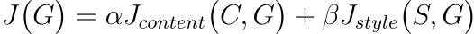
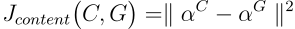
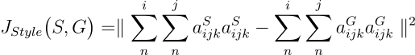
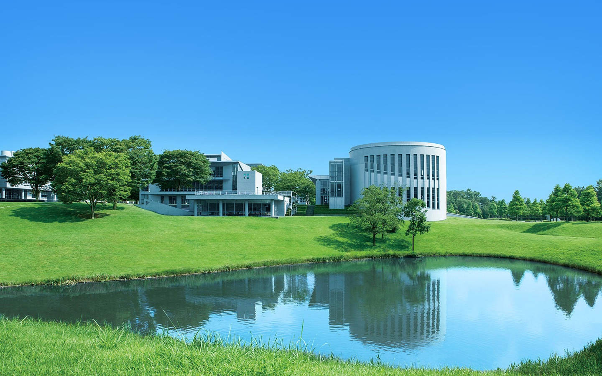
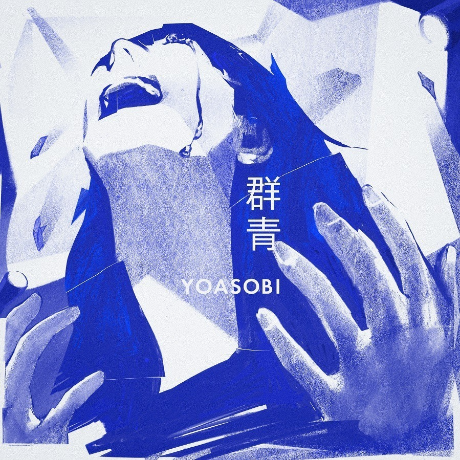
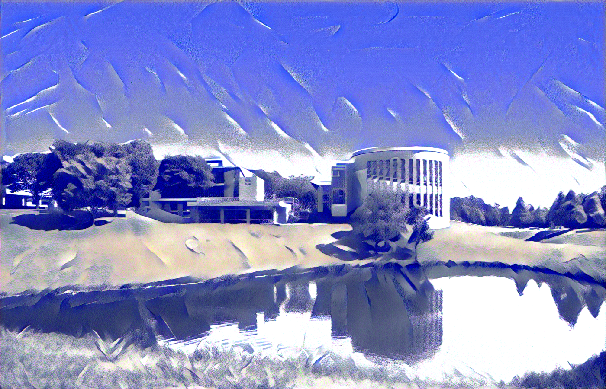

# Neural Style Transfer

## Intuition

As the name suggests, Neural Style Transfer (NST)transfers the style of one image to another image, without changing the content of the target image.

1. Ready a pretrained CNN model (such as VGG16)
2. Intialize the generated image randomly (or by copying the content image)
3. For each epoch
   3.1 run the content image, the style image, and the generated image through the network
   3.2 compute the content loss and style loss
   3.3 perform SGD on the generated image
4. after 5000~ epochs, the generated image should look like the content image in the style of the style image

## Loss Function

NST uses the loss function:



where `J(C,G)` represents the content loss, and `J(S,G)` represents the style loss. Alpha and Beta each denote the weight of the losses.

### Content Loss

1. Select a hidden layer `l` to use to compute the content loss
2. Run the content image, the style image, and the generated image through the network
3. Let `a(C)` & `a(G)` be the activation of layer `l` on the content image and generated image.
4. Compute the loss as follows:



```python=
#gf = generated features, cf = content features
content_loss += torch.mean((gf-cf)**2)
```

Basically, if the contents of the two images are similar, the activations in a pretrained network should be similar as well.

### Style Loss

1. Select a hidden layer `l` to use to compute the content loss
2. Style is defined as correlation between activations across channels
   - for example, if channel 1 detected stripe patters and channel 2 detected the color blue, a strong correlation between the two channels would imply a style where blue stripes are a common occurance
3. Let `i`,`j`,`k` be the height,width and channels of layer `l`
4. Compute the loss as follows:



```python=
Gram_gen = gf.view(channel,height*width).mm(gf.view(channel,height*width).t())

Gram_style = sf.view(channel,height*width).mm(sf.view(channel,height*width).t())

style_loss += torch.mean((Gram_gen - Gram_style)**2)

```

Here, the Style Loss is calculated by using gram matrices.

## Example

(900x1400 image, 6000 epochs)

| Content Image        | Style Image             |
| -------------------- | ----------------------- |
|  |  |

| Result                     |
| -------------------------- |
|  |

## References

- Aladdin Persson's video I referenced for the code:https://www.youtube.com/watch?v=imX4kSKDY7s

- Andrew Ng's videos I referenced for the intuition:https://www.youtube.com/watch?v=R39tWYYKNcI&t=0s
